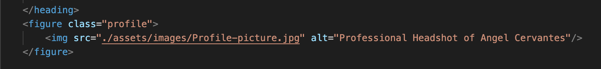
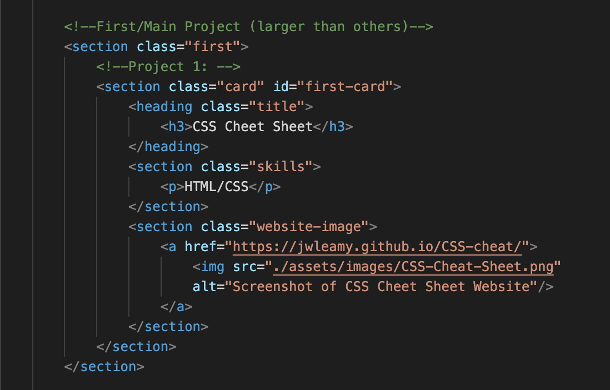

# my-portfolio

## Description

When applying for jobs or internships, it is immensely beneficial for the candidate to have a portfolio that shows off their skills through projects that they created or contributed greatly to. This was my motivation for creating this website; I want a place to show off all of my relevant work so that potential employers can see what I am capable of. Using the html, css, amd javascript skills that I have learned so far, I have complied a website that describes me and the work that I am proudest of. Through creating this website, I learned to apply my new css knowledge. I also practiced google fu skills whenever I wanted to add something new that I had never learned before or whenever I ran into a bug that my current knowledge was unable to solve. I was able to expand a solidfy my learning through this experience and I am excited to be able to share that with potential employers. 

## Table of Contents (Optional)

If your README is long, add a table of contents to make it easy for users to find what they need.

- [Installation](#installation)
- [Usage](#usage)
- [Credits](#credits)
- [License](#license)

## Installation

1. Click on green code button and copy the ssh link
2. Open up terminal or git bash, then navigate to where you want the repository to be placed.
3. Type out "git clone (ssh link)"

## Usage

One way that this can be used is as a template for your own portfolio. First, clone this repo into your terminal by following the installation instructions above. Then open up the index.html file. 

Find the tag 'figure class="profile"'. (It should be right under the main-heading heading).

Replace the link within the 'img' tag labeled 'src' with a link to an image that represents your project. Then, replace the alt text with text that describes your image.

Find the section labeled with the comment 'Project 1':

Go to the heading labeled 'class="title"', and replace the text within the 'h3' tag with your project title. Go to the section labeled 'class="skills"', and replace the text within the 'p' with the skills that you used on your project. Lastly, go to the section labeled 'class="website-image"', replace the link within the 'a' tag labeled 'href=' with a link to your project. Now, replace the link within the 'img' tag labeled 'src=' with a link to an image that represents your project. Don't forget to replace the alt text with text that describes your image.

Repeat with all of the following projects labeled with the comments 'Project 2', 'Project 3', 'Project 4', and 'Project 5'.

## Credits

Calc for variables: https://developer.mozilla.org/en-US/docs/Web/CSS/calc

Examples of using images as links: https://www.w3schools.com/html/tryit.asp?filename=tryhtml_links_image

Links within the same page: https://forum.freecodecamp.org/t/nav-bar-with-link-to-section-in-same-page/501465

## License

Please refer to LICENSE in this repository

## Badges

